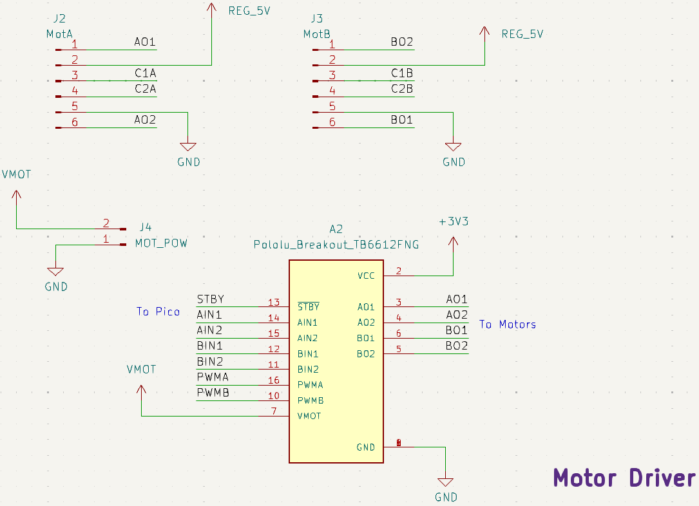
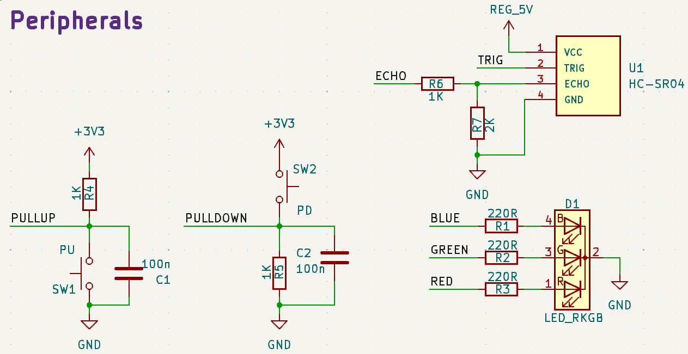

# Motor Control (Pico Carrier) Board Schematic

## Overview

The motor control board (MCB) hosts following components and peripherals:

- Raspberry Pi Pico,
- Pololu TB6612FNG dual motor driver carrier
- E-S N20 geared DC motors and encoders
- HC-SR04 ultrasonic distance sensor
- Common cathode RGB LED
- Pull-up resistor for Pico
- Pull-down resistor for Pico

## Power Management

The MCB receives two sources of DC power and supply them to the components on the board.

1. 7.4V (nominal) for Pololu TB6612FNG motor driver carrier.
2. 5V for Raspberry Pi Pico (optional), HC-SR04 distance sensor, motor encoders.

## Pico Wiring

- `J8` is the 5V input connected to the power expansion board (PEB).
- `SW3` is a switch for Pico to select power sources (`off`: USB, `on`: PEB)
- `J10` provides extra connections to unoccupied GPIOs.

## Motor and Motor Driver Wiring

- `J4` (MOT_POW) serves 7.4V (nominal) DC to power Pololu TB6612FNG motor driver carrier.
- `J2` and `J3` provides connections for right and left motor.

## Distance Sensor and Peripherals Wiring

- `SW1` needs to be configured to `PULLUP`, and SW2 needs to be configured to `PULLDOWN`.
Both are debounced.
- `ECHO` signal from HC-SR04 is 5V, so `R6` and `R7` are used to level the voltage down to around 3.3V.

