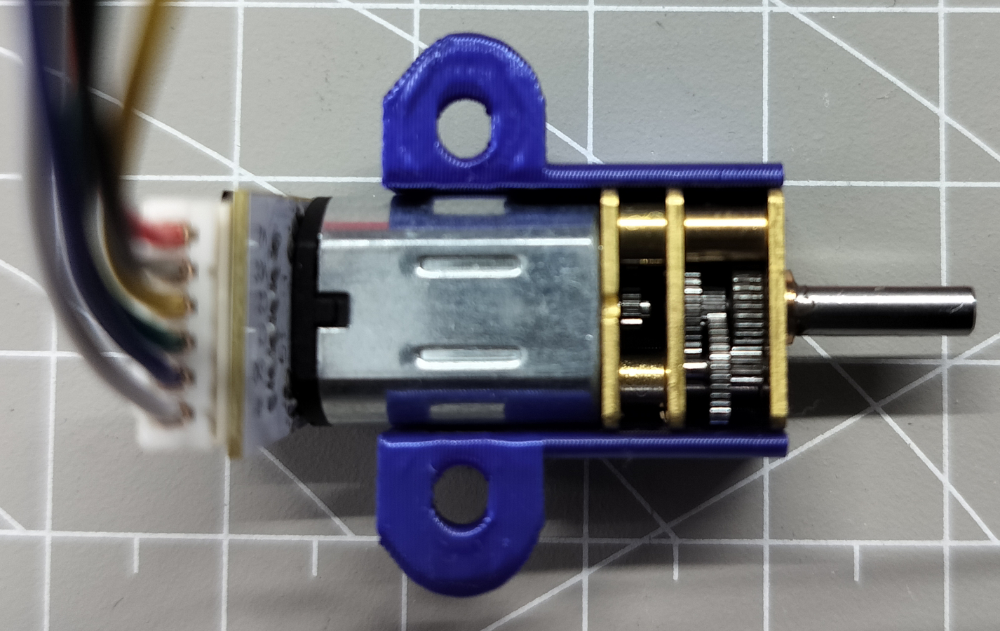
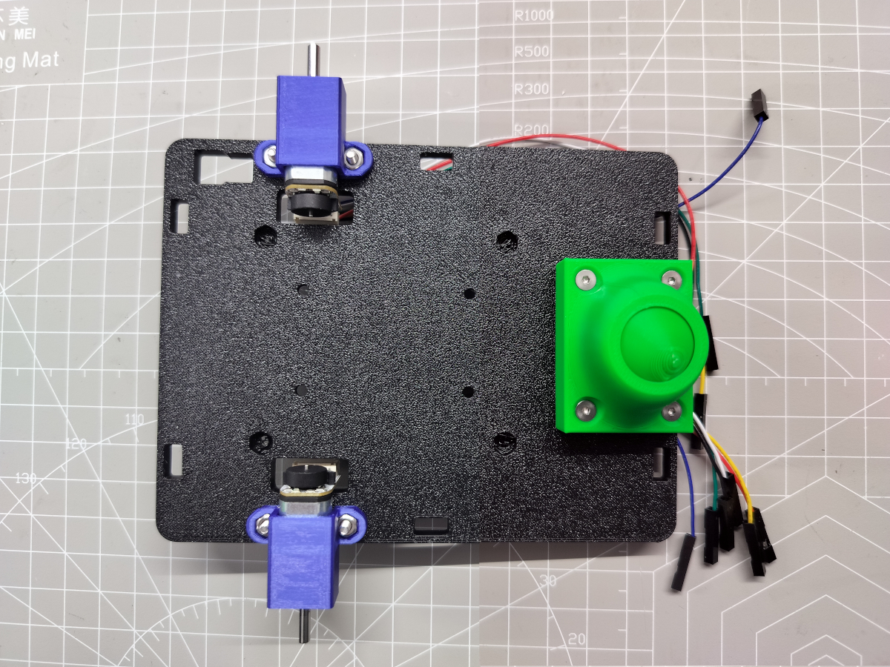

# R1B Assembly Guide

## 1 Assemble Motor

> Align motor and bracket with grooves in the bracket.

## 2 Attach Motors to Bed

### Top View

### Bottom View

## 3 Attach Caster Wheel to Bed

## 4 Assemble Wheel

## 5 Attach Wheels

## 6 Attach Battery Holder

